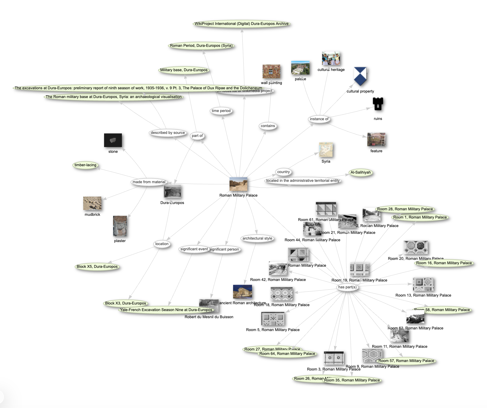

# Intro to SPARQL for Cultural Heritage Data in Wikidata<a id="ref1" href="#fn1"><sup>1</sup></a>
This tutorial introduces the basics of querying Wikidata using SPARQL, the query language for RDF data. We will start with simple queries and work our way up to more complex ones, including visualizations like maps, charts, and graphs. The Wikidata Query Service at https://query.wikidata.org/ will be our main tool throughout this tutorial.

# Learning Objectives
1. Introduce query languages in general, and SPARQL specifically 
2. Build baseline skills for structuring queries to interact with knowledge graph data and generate data vizualizations
3. Introduce the purpose and usefulness of queries for identifying missing information

# "Quick and dirty" Keyword Searching
There are different ways to query information in Wikidata. The simplest way is to use the search bar at the top of a Wikidata page to for search for a keyword, e.g. search for the Synagogue at Dura-Europos. The search bar at the top of a Wikidata page is set to look by default to search only in the Q-pages (that is, Wikidata items). 
However, the drop down menu at the left of the search box can also be toggled to search for a property (looking in the P-pages). On a separate tab, take a moment to familiarize yourself with this feature. Paying attention to the drop down menu at the left of the search bar, search first for the item (Q-number) for the Synagogue at Dura-Europos. Next, toggle your dropdown to search in the properties (P-numbers) for the "significant person" property page.

The "quick and dirty" method is not much different from other keyword searches you're probably already familiar with. SPARQL queries, in contrast, are much more powerful, as they allow you to search in much more nuanced and granular ways, essentially allowing a user to crawl through a web of relationships among datapoints.

Before we jump into SPARQL, a few useful tips to be aware of as you start exploring the Wikidata ecosystem:
1. For any given entry, there is always the possibility to see other pages that link to the page of interest , e.g. all pages linking to the item for the Synagogue at Dura: [https://www.wikidata.org/wiki/Special:WhatLinksHere/Q39246](https://www.wikidata.org/wiki/Special:WhatLinksHere/Q1577089). Each WD item/property page should have a "What Links Here" link in the righthand menu (sometimes hidden under three vertical dots).

2. To discover Wikidata objects nearby your physical location, you might explore the "nearby search": https://www.wikidata.org/wiki/Special:Nearby

3. WikiProject IDEA items are indexed in Wikidata with the property **on focus list of wikimedia project (P5008)** pointing to **Wikiproject IDEA (Q114241199)**.

---
## Lesson 1: What is SPARQL?

SPARQL is a query language for [RDF data](https://en.wikipedia.org/wiki/Resource_Description_Framework) and has been part of the [W3C recommendations](https://en.wikipedia.org/wiki/World_Wide_Web_Consortium) since 2008. 

Imagine that key pieces of information -- facts and interpretations (this sculpture was found in the Temple of Artemis; this wall painting depicts a Roman general) -- can be broken down into three distinct kernels (often referred to as "nodes") that can be strung together to express the idea.  This is the concept of a ["triple"](https://en.wikipedia.org/wiki/Semantic_triple) in RDF. A "subject" node can have a relationship -- a "predicate" -- with an "object" node, thereby expressing the fact/interpretation. 
For example, in the statement "Bob knows John", "Bob" is the subject, "knows" is the relationship (Predicate), and "John" is the object. When we string those three elements together, we have expressed a fact!
One node can have relationships with many different nodes, and those nodes have relationships with other nodes; RDF build into a giant web of data known as a [knowledge graph](https://en.wikipedia.org/wiki/Knowledge_graph).

For example here we see information about the building known as the ["Roman Military Palace"](https://www.wikidata.org/wiki/Q2047390) at Dura-Europos expressed as a knowledge graph:


---

## Exercise 1: Basic Item Retrieval

[Write a SPARQL query in the Wikidata Query Service (WDQS)](https://query.wikidata.org) to retrieve all items on the WikiProject IDEA focus list.

<details>
<summary>Show me the solution</summary>

[Try this query live on the Wikidata Query Service](https://query.wikidata.org/#SELECT%20%3Fitem%20%3FitemLabel%20WHERE%20%7B%0A%20%20%3Fitem%20wdt%3AP5008%20wd%3AQ114241199%20.%0A%20%20SERVICE%20wikibase%3Alabel%20%7B%20bd%3AserviceParam%20wikibase%3Alanguage%20%22%5BAUTO_LANGUAGE%5D%2Cen%22%20.%20%7D%0A%7D%0ALIMIT%2050)

```sparql
SELECT ?item ?itemLabel WHERE {
  ?item wdt:P5008 wd:Q114241199 .
  SERVICE wikibase:label { bd:serviceParam wikibase:language "[AUTO_LANGUAGE],en" . }
}
LIMIT 50
```

</details>
<hr>

<p id="fn1"><sup>1</sup> This tutorial adapts and builds upon the <a href="https://librarycarpentry.github.io/lc-wikidata/05-intro_to_querying.html">Library Carpentry Wikidata tutorial</a>. <a href="#ref1">↩</a></p>
